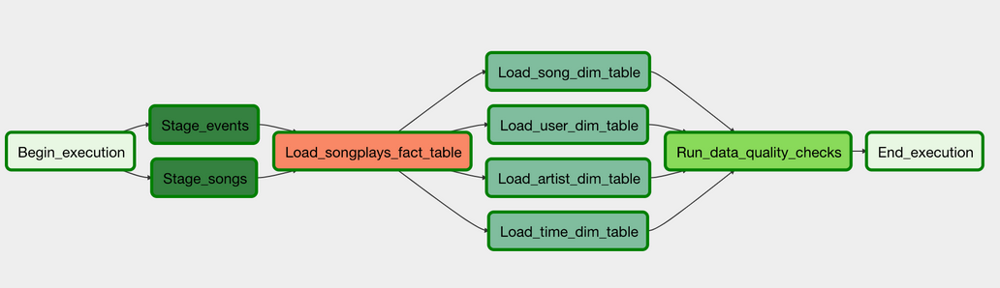

# Project: Data Pipeline with Airflow

## Introduction

A music streaming company, Sparkify, has decided that it is time to introduce more automation and monitoring to their data warehouse ETL pipelines and come to the conclusion that the best tool to achieve this is Apache Airflow.

The task for the responsible data engineer is to build a airflow pipline that extracts, transforms and loads the data. The data is thereby extracted in a first step from a [AWS S3 bucket](https://docs.aws.amazon.com/AmazonS3/latest/userguide/Welcome.html), staged into [Redshift](https://aws.amazon.com/de/redshift/?whats-new-cards.sort-by=item.additionalFields.postDateTime&whats-new-cards.sort-order=desc) and transformed into one fact table (songplays) and four dimension tables (users, artists, songs time), that can be subsequently used for analystics.

A screenshot of the DAG (Directed Acyclic Graph) is displayed below


## Project Datasets
For this project we use data from two datasets, that are stored in s3 buckets on AWS:

Song Data Path --> s3://udacity-dend/song_data
Log Data Path --> s3://udacity-dend/log_data
Log Data JSON Path --> s3://udacity-dend/log_json_path.json

Song Dataset
The first dataset is a subset of real data from the Million Song Dataset(https://labrosa.ee.columbia.edu/millionsong/). Each file is in JSON format and contains metadata about a song and the artist of that song. The files are partitioned by the first three letters of each song's track ID. For example:

song_data/A/B/C/TRABCEI128F424C983.json song_data/A/A/B/TRAABJL12903CDCF1A.json

And below is an example of what a single song file, TRAABJL12903CDCF1A.json, looks like.

{"num_songs": 1, "artist_id": "ARJIE2Y1187B994AB7", "artist_latitude": null, "artist_longitude": null, "artist_location": "", "artist_name": "Line Renaud", "song_id": "SOUPIRU12A6D4FA1E1", "title": "Der Kleine Dompfaff", "duration": 152.92036, "year": 0}

Log Dataset

The second dataset consists of log files in JSON format. The log files in the dataset with are partitioned by year and month. For example:

log_data/2018/11/2018-11-12-events.json log_data/2018/11/2018-11-13-events.json

And below is an example of what a single log file, 2018-11-13-events.json, looks like.

{"artist":"Pavement", "auth":"Logged In", "firstName":"Sylvie", "gender", "F", "itemInSession":0, "lastName":"Cruz", "length":99.16036, "level":"free", "location":"Klamath Falls, OR", "method":"PUT", "page":"NextSong", "registration":"1.541078e+12", "sessionId":345, "song":"Mercy:The Laundromat", "status":200, "ts":1541990258796, "userAgent":"Mozilla/5.0(Macintosh; Intel Mac OS X 10_9_4...)", "userId":10}

## Tables
For the etl we utilize one fact table (songplays) and four dimension tables (users, songs, artists and time).

Fact Table

songplays - records in event data associated with song plays i.e. records with page NextSong songplay_id, start_time, user_id, level, song_id, artist_id, session_id, location, user_agent

Dimension Tables

users - users in the app user_id, first_name, last_name, gender, level

songs - songs in music database song_id, title, artist_id, year, duration

artists - artists in music database artist_id, name, location, lattitude, longitude

time - timestamps of records in songplays broken down into specific units start_time, hour, day, week, month, year, weekday

## Folder Structure
- dags contains dag for airflow pipeline
- plugins contains airflow plugins, operators for airflow tasks
- create_tables.sql contains sql code for creation of sql tables
- README.md README

## Run
0. Setup Redshift Cluster, add IAM role, edit security and network settings and make cluster available, install airflow 
1. Run sql querys in create_tables.sql to create tables on cluster
1. Start aiflow
2. Add connection credentials for redshift cluster in airflow Admin
3. Add IAM role variable in airflow admin
4. Run /dag/udac_example.py to create tables ```python create_tables.py```

## ETL Pipeline
1. Begin of pipeline
2. Creating a redshift instance
3. Create tables
4. Copy and stage data from s3 in staging tables
5. Insert data in fact and dimension tables
6. Quality Check
7. End of pipeline